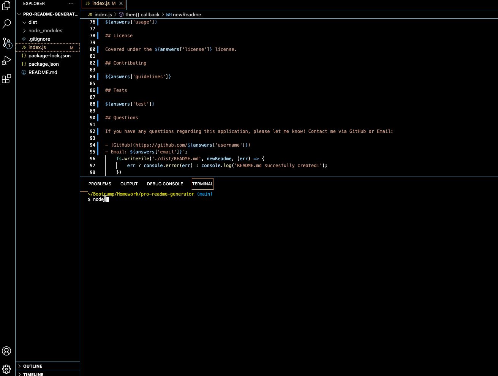

# Professional README.md Generator

## Table of Contents

1. [Description](#description)
2. [Visuals](#visuals)
3. [Deployment](#deployment)

## Description

This program uses Node.js to generate a professional style README.md file with content generated by the user's responses to a series of questions. It uses JavaScript, Node.js, as well as the package Inquirer.

## Visuals

## Deployment

[> Link to GitHub Repo <](https://github.com/slwooten/pro-readme-generator)